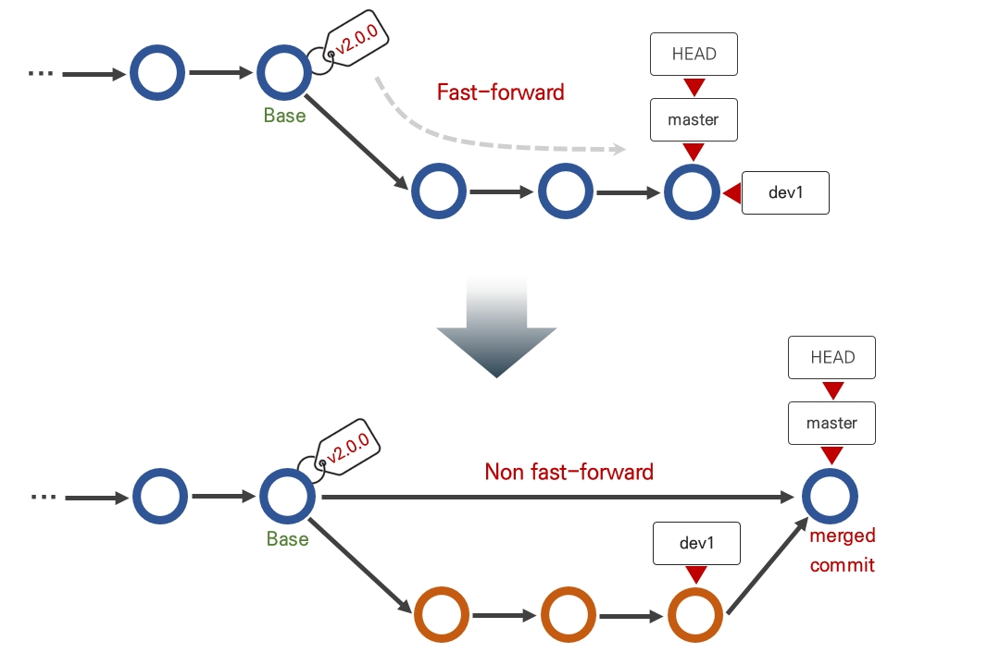
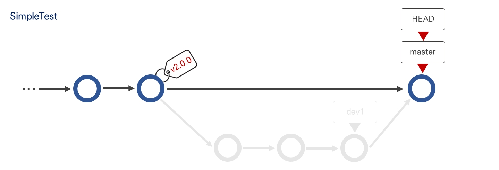

# Git

42에서 지내면서 자연스럽게 체화된 git..  
하지만 IDE 사용이 늘어나면서 점점 GUI 환경에 익숙해져 커맨드고 뭐고 까먹게 되고  
날 잡고 정복해보고자 북마크에 넣어둔 git 학습 사이트는 점점 기억 뒤편으로 넘어갔다.

 

## 새로 알게된 command

### `git merge --no-ff`

로그 그래프에 브랜치 분기 구분이 시각화된다.  
분기들이 병합이 되어 하나의 가닥이 되지 않는다.

 

#### 더 자세히?

우선 "fast-forward"를 이해해야 한다.  
fast forward 관계는 분기한 브랜치의 커밋 히스토리가 기존 브랜치의 커밋 히스토리를 포함할 때라고 한다.  
즉, 두 브랜치의 base에 하나의 브랜치가 머물러 있는 경우 **_Fast-forward_** 상태에 있다고 한다.

각각의 브랜치가 다른 commit을 생성하며 base로부터 분기가 갈라진 형태 (더이상 커밋 히스토리를 포함하지 못할 때)는 ff 관계가 아니며,  
이 상태에서 merge할 때 새 commit이 생성되고, 이러한 merge를 **_3-way merge_**라고 한다.

반면 ff 관계에 있는 브랜치를 merge하면 새 commit이 생기지 않고, 뒤에 있던 브랜치가 앞선 브랜치를 따라 이동한다.  
이렇게 이동하는 모습을 본떠 fast-forward(빨리감기)라고 부른다고 한다.

`git merge`의 기본 옵션은 `--ff`이며, ff 관계가 아닌 경우 merge commit이 생성된다.

이렇게 fast forward merge가 되면 base에 있던 브랜치가 앞선 브랜치의 커밋 히스토리를 따라가 병합되므로, 분기를 나눴던 히스토리가 없어진다.

따라서 분기를 나눴던 히스토리를 유지하기 위해 (=merge commit 추가) `--no-ff` 옵션으로 ff 관계여도 merge commit을 생성하도록 한다.

 

#### 추가 옵션 `--squash`

쓸 일이 전혀 없을 것 같으므로 간단한 기록만.

기본 `--ff` 옵션의 정반대로 동작하는 merge 옵션이다.  
디폴트는 앞선 브랜치의 커밋 히스토리를 따라 기준 브랜치가 옮겨가 병합이 되었다면,  
squash는 뭉개다는 뜻 그대로, 앞선 브랜치의 커밋 히스토리를 모두 무시하고 commit, merge 이력이 모두 사라져 하나의 합쳐진 브랜치만 남게 된다.

 

### `git commit --amend`

amend 옵션을 추가하면 가장 마지막 커밋을 수정할 수 있다.  
이 때, 변경사항과 함께 커밋 hash도 변경되는데 이를 통해 새로운 commit을 하도록 내부 동작한다는 것을 알 수 있다.
